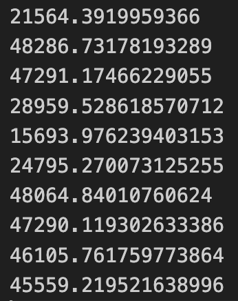
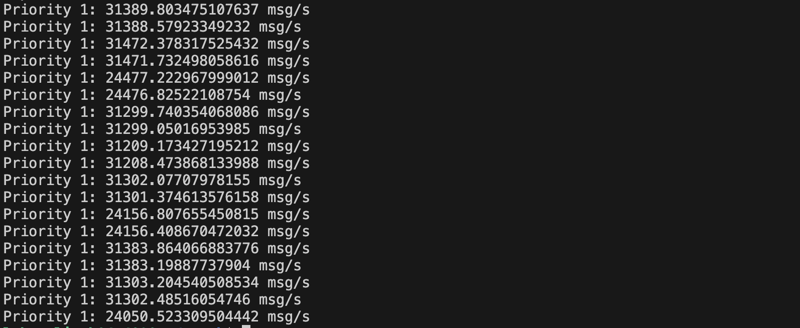

# TAPRIO on Zenoh experimental result

## p=1, 2, 3

### on pub
```
sched-entry S 03 1000000 \
sched-entry S 05 3000000 \
sched-entry S 09 5000000 \
```

- p1: 27438.11878
- p2: 28825.8863
- p3: 28820.70199

### on sub
```
sched-entry S 03 1000000 \
sched-entry S 05 3000000 \
sched-entry S 09 5000000 \
```

- p1: 44293.78231
- p2: 46067.4276
- p3: 41663.88396

### delete TAPRIO settings on both pub and sub

- p1: 79584.90832
- p2: 74981.0241
- p3: 74930.43537

### p=1, 2,3 
```
sched-entry S 03 1000000 \
```
None of them received, replacing 03 with 05 or 09 also didn't work. Adding one more 0 to 1000000 didn't work either.

```
sched-entry S 03 1000000 \
sched-entry S 09 5000000 \
```
None of them received.

```
sched-entry S 05 3000000 \
```
None of them received.

```
### on pub
sched-entry S 03 1000000 \
sched-entry S 05 3000000 \
sched-entry S 09 5000000 \
```
All three received, but without distinction.

## p=1

### on pub
sched-entry S 03 1000000 \
sched-entry S 05 3000000 \
sched-entry S 09 5000000 \

- p1: 29727.14288

## p=2

### on pub
sched-entry S 03 1000000 \
sched-entry S 05 3000000 \
sched-entry S 09 5000000 \

- p2: 94691.03561

## p=3

### on pub
sched-entry S 03 1000000 \
sched-entry S 05 3000000 \
sched-entry S 09 5000000 \

- p3: 158004.1489

## p=1 2

### on pub
sched-entry S 03 1000000 \
sched-entry S 05 3000000 \
sched-entry S 09 5000000 \

- p1: 36350.44085
- p2: 36450.19939

Numbers are fluctuating, not stable.



## p=1 1

Mainly testing if different threads receiving the same packets would yield different results. 
Opened two threads subscribing to the same topic.



Adjacent numbers are almost the same. It can be inferred that when there is a large difference between numbers received with different priorities, they are not from the same batch.

## pub_p=1 2 3, sub_p=2

### on pub
sched-entry S 03 1000000 \
sched-entry S 05 3000000 \
sched-entry S 09 5000000 \

- p2: 94532.33984

Although the performance when there are three priorities on the publisher side and only one on the subscriber side is the same as when only one priority is sent, it is reasonable because when there is no subscriber to receive, Zenoh will stop sending packets for that session. We believe the problem is more likely to occur on the publisher side.

