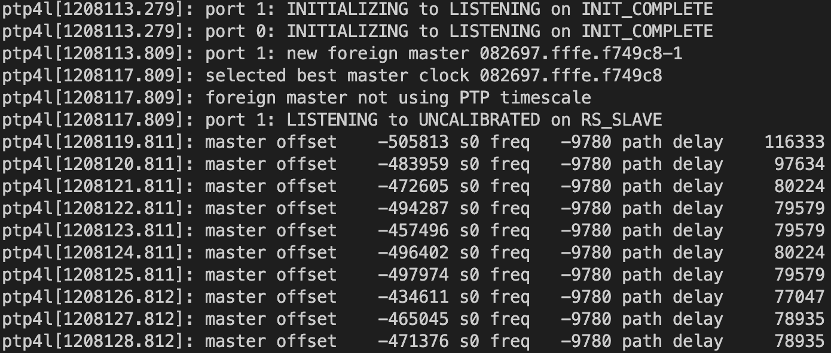

# PTP
To use gPTP (Generalized Precision Time Protocol), you need to configure PTP first.
In Linux, a commonly used tool is ptp4l.

Install the ptpd package:
```
apt install ptpd
```

To check the PTP status, install the linuxptp package:
```
apt install linuxptp
```
This package includes ptp4l.

Check if your hardware supports hardware timestamps:
```
sudo ethtool -T enp3s0
```
If it only supports software timestamps, the output will look like this:
```
Capabilities:
        software-transmit
        software-receive
        software-system-clock
PTP Hardware Clock: none
Hardware Transmit Timestamp Modes: none
Hardware Receive Filter Modes: none
```

For hardware support, you need the following capabilities:
```
SOF_TIMESTAMPING_RAW_HARDWARE
SOF_TIMESTAMPING_TX_HARDWARE
SOF_TIMESTAMPING_RX_HARDWARE
```
## Software stamp
One device operates as the master:
```
sudo ptp4l -i ens1 -m -S
```

The other device operates as the slave:
```
sudo ptp4l -i enp3s0 -m -S -s
```


PTP statuses are indicated as follows:
- s0: Unlocked
- s1: Synchronizing
- s2: Locked

When the slave successfully synchronizes, you will see a message like this:
```
ptp4l[1208136.813]: port 1: UNCALIBRATED to SLAVE on MASTER_CLOCK_SELECTED
```

## Hardware stamp

One device operates as the master:
```
sudo ptp4l -i ens1 -m -H
```

The other device operates as the slave:
```
sudo ptp4l -i enp3s0 -m -H -s
```

TSN system requires PHC synchronization.
To synchronize the time obtained through the PTP protocol with the system, execute the `phc2sys` command.

REF: [Synchronizing Time with Linux* PTP](https://tsn.readthedocs.io/timesync.html)
